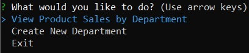

# Bamazon

It consists of three apps for the control of an online store.
   * bamazonCustomer.js
   * bamazonManager.js
   * bamazonSupervisor.js

## bamazonCustomer.js

The CLI app will take in orders from customers and deplete stock from the store's inventory.

 

After each purchase the customer will receive their receipt.

Then they going to be prompted.

## bamazonManager.js

The manager going to be prompted ones he runs the app and after each operation.

 
 
  * View Products for Sale

    
    
  * View Low Inventory

   
    
  * Add to Inventory

   
    
  * Add New Product

   

## bamazonSupervisor.js

The supervisor going to be prompted ones he runs the app and after each operation.

  * View Product Sales by Department

   
   
  * Create New Department

   